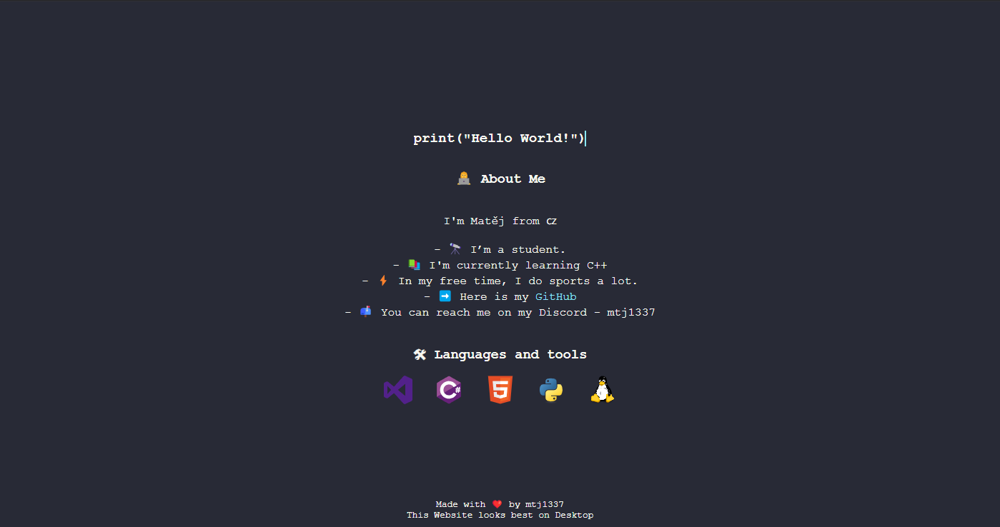

# mtj1337 - Personal Website

Welcome to my personal website! This website is a showcase of my projects, interests, and skills. Built using HTML, CSS, and JavaScript, it features a **Dracula** theme with a typing effect that showcases various programming languages. 

## Features
- **Responsive Design**: Optimized for both desktop and mobile views.
- **Typing Effect**: Displays code snippets in various programming languages with a typing effect.
- **Dracula Theme**: The website follows the popular Dracula theme with dark backgrounds and bright neon highlights.
- **Links**: GitHub and other personal links are integrated as interactive buttons.

## Screenshot

 <!-- Optional: Upload a screenshot of the website and reference it here -->

## Technologies Used
- **HTML**: Structure and content of the website.
- **CSS**: Styling with a Dracula theme for a dark, modern look.
- **JavaScript**: Typing effect functionality to simulate typing in various programming languages.
- **Font**: Monospace font for a coding-like feel.

## Sources
- Thanks to the [Dracula Theme](https://draculatheme.com/) for the inspiration behind the color scheme.
- The typing effect is inspired by various open-source projects and tutorials.
